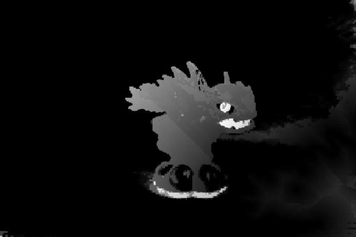
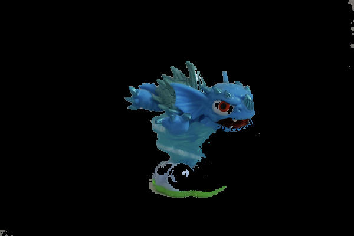

# Stepth

Library to create and manipulate with depth images.
Uses [image-rs](https://github.com/image-rs) and [disage](https://github.com/ZhavoronkovN/disage)

## Code example

```
use stepth;

fn main() {
    // loading depth from additional image
    let mut img = stepth::DepthImage::open("mains.jpg").unwrap();
    let depth_precision = [u8::MAX/7;3];
    img.open_depth_from_additional("additionals.jpg", depth_precision).unwrap();
    img.depth().save("depth.jpg").unwrap();

    // loading depth from file and applying some mask operations
    let mut img = stepth::DepthImage::open("mains.jpg").unwrap();
    img.open_depth("depth.jpg").unwrap();
    img.invert_depth();
    let mut mask = img.select_foreground();
    mask.apply_mask();
    mask.save("foreground.jpg").unwrap();
}
```

## Work example

Input :


Depth :


Applied mask :
