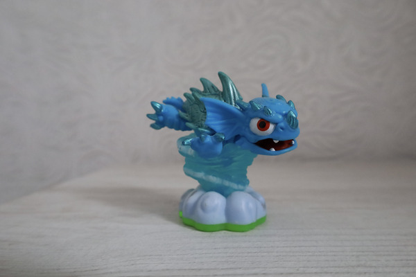
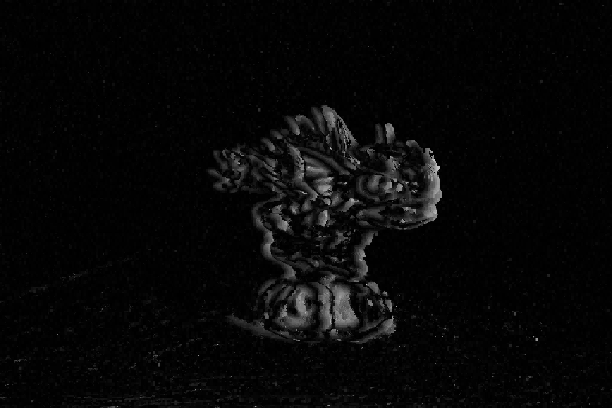

# Stepth

Object recognition and depth mapping using stereo images.
Uses [image-rs](https://github.com/image-rs) and [disage](https://github.com/ZhavoronkovN/disage)

## Code example

```
let main_img = image::open("inputs/main.jpg").unwrap().to_luma16();
let additional_img = image::open("inputs/additional.jpg").unwrap().to_luma16();
let depth_discrete = luma_depth(&main_img, &additional_img, 5, 200, (16,20));
let depth_array = depth_discrete.collect();
let broad_depth = broaden_depth(&depth_array);
let output_img = disage::converters::to_luma8_from32(&broad_depth);
```

## Work example

Input :


Output :

